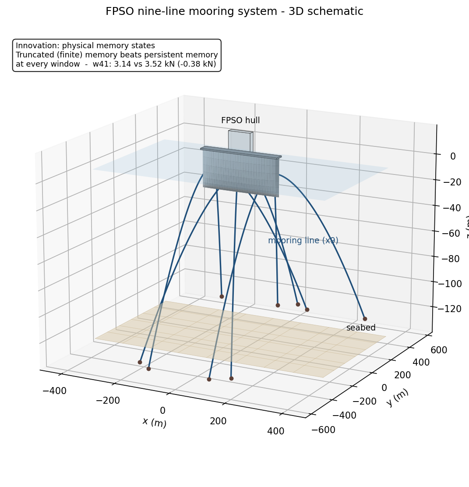
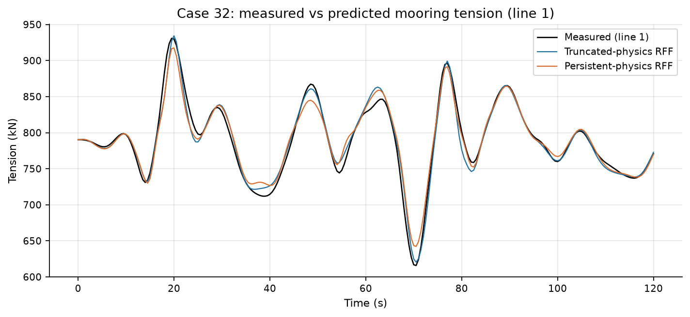
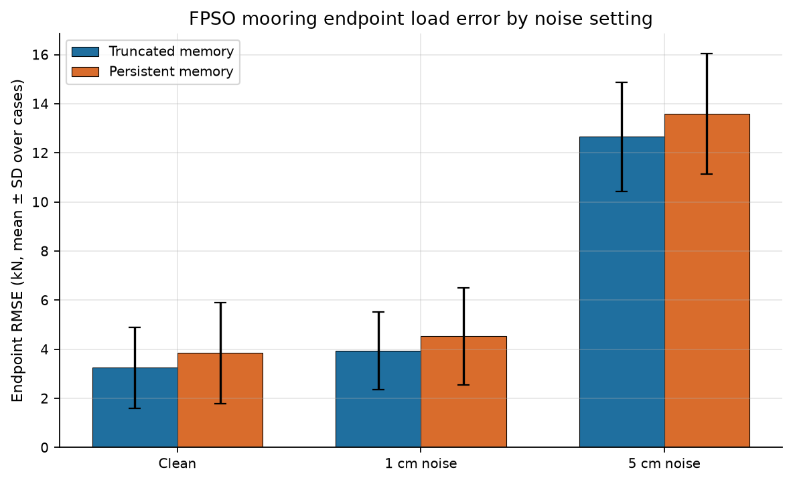

# FPSO 九线系泊载荷与物理记忆状态

## 效果展示

  
  

## 问题与方法

研究九线转塔 FPSO 的端点受力定义、有限运动记录的信息限制与物理状态近似。几何沿用公开 322 m FPSO；1535 m 水深，链—钢丝绳—链。MoorDyn 是标签生成求解器，船体运动人为规定；波浪、海流和附加质量在当前实验关闭。

原研究包含 32 个静态姿态、12 条训练与 4 条验证轨迹，以及冻结后生成的 16 条新测试轨迹；比较 28 种标量方法。九线力向量、合力和转塔力矩另行评估，不能用单线标量误差代替它们。

## 本包运行

在根目录运行 `python src/demo.py && python src/verify.py`，不需要安装 MoorDyn。

- `physical_state.py` 提取原持续/有限模态状态实现；示例使用合成运动，检查未来不变性及停止后状态。
- 对所有已存 case-window RMSE 复算方法均值。
- `example_case32.npz` 和 `example_case32_predictions.npz` 保留一条原仿真轨迹及全部 28 个方法预测，独立复算 30 秒后的九线 RMSE。

| 新测试平均 case RMSE | kN |
| --- | ---: |
| 八秒快照 RFF | 3.201 |
| 有限记忆物理 RFF | 3.205 |
| 持续记忆物理 RFF | 3.743 |
| 通用持续记忆储备池 | 3.186 |

持续物理 RFF 在 **0/16** 算例胜过有限版本；平均配对增益 **−0.538 kN**。四条新停止轨迹保留有限记录经验误差下限 **0.435 kN**，但该下限远低于整体模型误差。较大合成姿态噪声下误差明显上升，不能宣称传感器部署就绪。

## 完整复现与限制

主仓库只随附 case32 完整预测回放；其余 15 条在独立完整研究附件中。本次实际从附件独立解包运行原全包核验，32 动态轨迹、32 静态姿态、16 测试算例、28 方法、1,120 标量指标及矢量指标全部通过。完整结果见 `data/full_archive_verification.json`；这不等于重新求解或重新训练。附件运行命令见 [实物资产清单](../../docs/ASSET_AUDIT.md)。完整本地附件名称：`fpso-endpoint-reproduction-v0.5.0.zip`，含核验所需的冻结源码、模型与轨迹，约 197 MiB。发布大型附件应另建 GitHub Release；主仓库不放原生二进制。

原生再生成依赖 MoorDyn 2.7.1 及匹配绑定；已有仿真生成时间线和源冻结属于本地记录，不是第三方预注册。独立弹性悬链线仅核验静态，无独立动态求解器、池试或现场张力验证。

求解器：[MoorDyn](https://moordyn.readthedocs.io/)。后续需要运动/海况/张力同步证据、直接流体载荷敏感性及独立动态参考。

## Figures

Regenerate with `python figures/make_figures.py` (needs `matplotlib`, `pandas`, `numpy`).

### 3D schematic illustration

Schematic illustration rendered in Python (matplotlib) - not ANSYS/Fluent/STAR-CCM+ output. Regenerate with `python figures/make_3d_schematic.py` (needs `matplotlib`, `numpy`). The 9 mooring lines and fairlead/anchor layout illustrate the physical system whose endpoint loads this project predicts.
